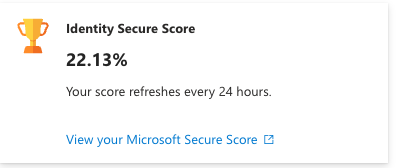
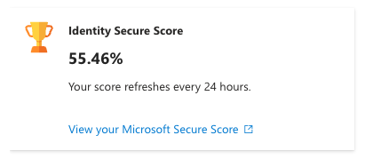
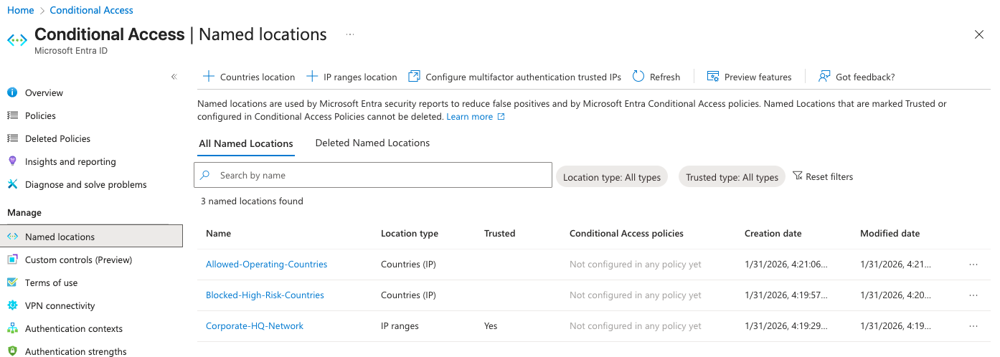
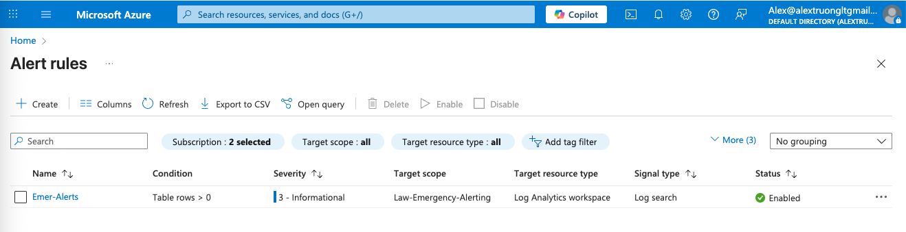
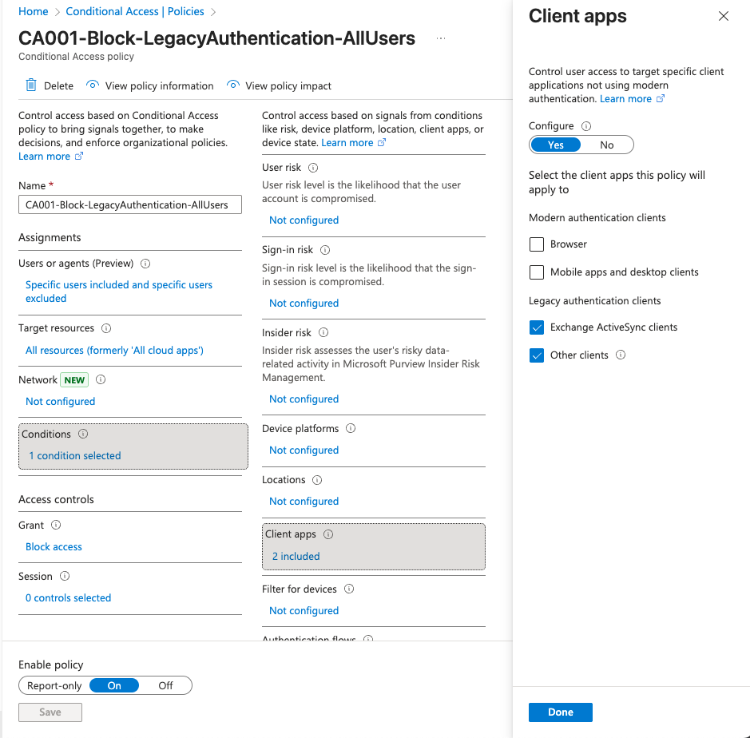

# Zero Trust Conditional Access Framework
### Microsoft Entra ID | 14-Policy Implementation

**Prepared by:** Alex Truong | Identity & Access Governance Analyst  
**Environment:** Microsoft Entra ID (Live Lab Tenant)  
**Completed:** January 2026  

---

## Table of Contents

- [Project Overview](#project-overview)
- [Environment & Tools](#environment--tools)
- [Results](#results)
- [Architecture: Security Groups & Named Locations](#architecture-security-groups--named-locations)
- [Phase 1 — Emergency Access & Monitoring Foundation](#phase-1--emergency-access--monitoring-foundation)
- [Phase 2 — Block Legacy Authentication](#phase-2--block-legacy-authentication)
- [Phase 3 — MFA Enforcement](#phase-3--mfa-enforcement)
- [Phase 4 — Device Compliance](#phase-4--device-compliance)
- [Phase 5 — Risk-Based Conditional Access](#phase-5--risk-based-conditional-access)
- [Phase 6 — Session Controls & Geo-Blocking](#phase-6--session-controls--geo-blocking)
- [Complete Policy Reference](#complete-policy-reference)
- [Testing & Validation](#testing--validation)
- [Key Takeaways](#key-takeaways)

---

## Project Overview

This project implements a full Zero Trust Conditional Access framework in Microsoft Entra ID using a fictional scenario — Contoso Financial Services (500 users) — that had experienced 3 account compromises in 6 months due to weak authentication controls, legacy protocol exposure, and no device compliance enforcement.

The implementation covers 14 tiered Conditional Access policies across 7 phases: emergency access foundations, legacy auth blocking, MFA enforcement, device compliance, identity risk responses, session controls, and geo-blocking. All policies were built, tested, and validated using the Entra ID What If tool and CA Insights workbook.

---

## Environment & Tools

| Tool | Purpose |
|------|---------|
| Microsoft Entra ID (P2 trial) | Identity platform, Conditional Access, Identity Protection |
| Microsoft Intune | Device compliance policies |
| Azure Log Analytics Workspace | Sign-in log ingestion for alerting |
| Azure Monitor | Emergency account alert rules (KQL-based) |
| Microsoft Defender Portal | Identity Secure Score tracking |
| Entra ID — What If Tool | Policy testing and validation |
| CA Insights & Reporting Workbook | Policy impact visualization |

---

## Results

| Metric | Before | After | Change |
|--------|--------|-------|--------|
| Identity Secure Score | 22.13% | 55.46% | **+33.33 points** |
| Legacy Auth Exposure | All protocols open | 100% blocked | Complete elimination |
| MFA Coverage | None | All users + risk-based | Full coverage |
| Privileged Account Controls | None | 4-hour session + phishing-resistant MFA | Enterprise-grade |
| Risk-Based Response | None (manual) | Automated block/remediation | Real-time |
| Device Compliance Enforcement | None | Required for sensitive apps | Zero Trust enabled |

**Before (Baseline):**  


**After (Post-Implementation):**  


---

## Architecture: Security Groups & Named Locations

Before creating any policies, I built the group and location structure that all 14 policies reference. This separation between inclusion and exclusion groups is what makes the framework manageable and auditable.

### Security Groups

| Group Name | Purpose |
|------------|---------|
| `CA-All-Users` | Included in all baseline policies |
| `CA-Executives` | Executive-specific policy targeting |
| `CA-Finance-Team` | Sensitive app and device compliance policies |
| `CA-Pilot-Users` | Initial policy testing before full rollout |
| `CA-Exclude-EmergencyAccess` | **Excluded from every policy** — breakglass accounts |

### Named Locations



| Location | Type | Trusted | Purpose |
|----------|------|---------|---------|
| `Corporate-HQ-Network` | IP ranges (/32 CIDR) | ✅ Yes | Trusted corporate network |
| `Allowed-Operating-Countries` | Countries | — | US, Canada, UK — permitted access zones |
| `Blocked-High-Risk-Countries` | Countries | — | Used in CA013 geo-block policy |

---

## Phase 1 — Emergency Access & Monitoring Foundation

**Why this phase is first:** Before creating any Conditional Access policy, emergency access accounts must exist. Without them, a misconfigured policy can lock every administrator — including you — out of the tenant permanently.

### Breakglass Accounts

Created two cloud-only Global Administrator accounts with 20+ character random passwords:
- `emergency1@[tenant].onmicrosoft.com`
- `emergency2@[tenant].onmicrosoft.com`

Both accounts were added to `CA-Exclude-EmergencyAccess` and excluded from every CA policy. Neither account has an Entra ID P2 license assigned — breakglass accounts don't need one and licensing them increases their attack surface.

### Emergency Account Alert (Azure Monitor + KQL)

Set up real-time alerting so any breakglass sign-in triggers an immediate email notification:

**Infrastructure:**
1. Created Log Analytics Workspace: `Law-Emergency-Alerting`
2. Configured Entra ID Diagnostic Settings to stream `SignInLogs` and `AuditLogs` to the workspace
3. Built an Azure Monitor alert rule scoped to the LAW (not the subscription — scoping to the subscription targets metrics, not logs)

**KQL Query used in the alert:**
```kql
union isfuzzy=true SigninLogs, Heartbeat
| where UserPrincipalName has "emergency1"
    or UserPrincipalName has "emergency2"
| project TimeGenerated, UserPrincipalName, AppDisplayName, IPAddress
```

> **Note:** `union isfuzzy=true` with `Heartbeat` prevents validation errors when `SigninLogs` is empty during initial log ingestion. Once logs are flowing, a direct `SigninLogs` query works fine.



---

## Phase 2 — Block Legacy Authentication

Legacy auth protocols (POP3, IMAP, SMTP AUTH, Exchange ActiveSync) do not support MFA. Attackers specifically target these protocols to bypass modern authentication controls. Microsoft reports that over 99% of password spray attacks use legacy auth.

### CA001 — Block Legacy Authentication



| Setting | Value |
|---------|-------|
| **Name** | `CA001-Block-LegacyAuthentication-AllUsers` |
| **Users — Include** | `CA-All-Users` |
| **Users — Exclude** | `CA-Exclude-EmergencyAccess` |
| **Target Resources** | All resources |
| **Conditions — Client Apps** | Exchange ActiveSync clients + Other clients (legacy only) |
| **Grant** | Block access |
| **Status** | On |

---

## Phase 3 — MFA Enforcement

Four policies create layered MFA coverage — from a broad baseline for all users to targeted, stricter controls for admins and risky sign-ins.

### CA002 — Require MFA for All Users

| Setting | Value |
|---------|-------|
| **Name** | `CA002-Require-MFA-AllUsers-AllApps` |
| **Users** | `CA-All-Users` / Exclude: Emergency |
| **Target Resources** | All resources |
| **Grant** | Require MFA |
| **Status** | On |

### CA003 — Require MFA for Admins (Stricter)

Targets directory roles directly rather than groups — any account assigned a privileged role is automatically in scope.

| Setting | Value |
|---------|-------|
| **Name** | `CA003-Require-MFA-Admins-AllApps` |
| **Users** | Directory roles: Global Admin, Security Admin, Exchange Admin, SharePoint Admin, User Admin, Privileged Role Admin |
| **Grant** | Require MFA + Authentication strength |
| **Session** | Sign-in frequency: 4 hours |
| **Status** | On |

> **Note on phishing-resistant MFA:** The "Require authentication strength — Phishing-resistant MFA" option (FIDO2/Windows Hello) was evaluated but requires hardware keys to be pre-enrolled. Set to standard MFA for this environment. In production, FIDO2 would be required for all Tier 1 roles.

### CA004 — Require MFA for Azure Management

Any user accessing Azure Portal, Azure Resource Manager, or the Microsoft Admin Centers must authenticate with MFA — regardless of location or device state.

### CA005 — Require MFA for Risky Sign-Ins

Triggers MFA when Identity Protection detects medium or high sign-in risk. This keeps friction low for normal sign-ins while automatically challenging anomalous ones.

---

## Phase 4 — Device Compliance

Zero Trust verifies the device, not just the user. These policies integrate Microsoft Intune compliance signals into access decisions.

### Windows Baseline Compliance Policy (Intune)

Created via Intune `Endpoint Security > Device Compliance`:

| Control | Requirement |
|---------|-------------|
| BitLocker | Required |
| Secure Boot | Required |
| Code Integrity | Required |
| Minimum OS Version | Windows 10: 10.0.19041.0 |
| Password | Required, minimum 8 characters |
| Firewall | Required |
| Antivirus | Required |

### CA006 — Require Compliant Device for Sensitive Apps

| Setting | Value |
|---------|-------|
| **Name** | `CA006-Require-CompliantDevice-SensitiveApps` |
| **Users** | `CA-Finance-Team` |
| **Target Resources** | Office 365 (sensitive apps) |
| **Conditions** | Device platforms: Windows, macOS |
| **Grant** | Require device marked as compliant |
| **Status** | On |

### CA007 — Require Hybrid Azure AD Joined Device

Set to **Report-only** — Hybrid Azure AD Join requires on-premises Active Directory, which is not present in this cloud-only lab environment. Configured to document the policy intent and demonstrate understanding of the control.

---

## Phase 5 — Risk-Based Conditional Access

These policies automate response to Microsoft's Identity Protection risk signals — compromised credentials detected on the dark web, impossible travel, anonymous IPs, and behavioral anomalies.

### CA008 — Block High User Risk

Immediately blocks access when Identity Protection classifies a user account as High risk (e.g., leaked credentials found in breach data).

### CA009 — Require Password Change for Medium User Risk

Allows access but forces a password change (with MFA verification) for medium-risk users. This enables self-remediation without IT intervention, reducing helpdesk load while containing potential compromises.

### CA010 — Block High Sign-In Risk

Blocks the specific sign-in when the real-time risk score is High — anomalous IP, impossible travel, token anomalies. The user account stays active; only that sign-in attempt is blocked.

---

## Phase 6 — Session Controls & Geo-Blocking

### CA011 — Sign-In Frequency for Sensitive Apps

Forces Finance team users to re-authenticate every 4 hours when accessing sensitive applications. Default Azure AD token lifetime is 24+ hours — this policy limits the damage window of a compromised session.

### CA012 — No Persistent Browser Session off Corporate Network

When users access from untrusted locations, their browser session does not persist. Closing the browser requires a full re-authentication. From `Corporate-HQ-Network`, sessions persist normally.

### CA013 — Block Access from High-Risk Countries

Uses the `Blocked-High-Risk-Countries` named location to deny all access attempts originating from geographic regions Contoso Financial does not operate in.

### CA014 — Require Approved Client App on Mobile

iOS and Android devices must use Microsoft-approved apps (Outlook, Teams, OneDrive) to access Office 365. Prevents corporate data from flowing into unmanaged third-party email or storage apps.

---

## Complete Policy Reference

| # | Policy Name | Phase | Grant/Block |
|---|-------------|-------|------------|
| CA001 | Block-LegacyAuthentication-AllUsers | Legacy Auth | Block |
| CA002 | Require-MFA-AllUsers-AllApps | MFA | Require MFA |
| CA003 | Require-MFA-Admins-AllApps | MFA | MFA + Auth Strength + 4hr session |
| CA004 | Require-MFA-AzureManagement | MFA | Require MFA |
| CA005 | Require-MFA-RiskySignIn | MFA / Risk | Require MFA |
| CA006 | Require-CompliantDevice-SensitiveApps | Device | Require compliant device |
| CA007 | Require-HybridJoined-InternalApps | Device | Hybrid join (Report-only) |
| CA008 | Block-HighUserRisk | Risk | Block |
| CA009 | RequirePasswordChange-MediumUserRisk | Risk | Require password change |
| CA010 | Block-HighSignInRisk | Risk | Block |
| CA011 | SignInFrequency-SensitiveApps | Session | MFA + 4hr frequency |
| CA012 | PersistentBrowser-Untrusted | Session | Never persistent |
| CA013 | Block-BlockedCountries | Geo | Block |
| CA014 | RequireApprovedApp-Mobile | Mobile | Require approved app |

---

## Testing & Validation

### What If Tool

Used Entra ID's What If tool to validate every policy before and after enabling. Example scenarios tested:

| Scenario | Expected | Result |
|----------|----------|--------|
| Regular user + Exchange ActiveSync | Blocked by CA001 | ✅ Confirmed |
| Regular user + modern auth + no MFA | Require MFA — CA002 | ✅ Confirmed |
| Admin account + any app | MFA + 4hr session — CA003 | ✅ Confirmed |
| Finance user + non-compliant device | Blocked — CA006 | ✅ Confirmed |
| Any user + High sign-in risk | Blocked — CA010 | ✅ Confirmed |
| Any user + blocked country | Blocked — CA013 | ✅ Confirmed |
| Mobile + non-approved app | Blocked — CA014 | ✅ Confirmed |

### CA Insights & Reporting Workbook

Monitored policy impact via the Conditional Access Insights workbook in the Entra portal (`Protection > Conditional Access > Insights and reporting`). This workbook shows sign-ins by policy outcome, grant controls applied, report-only mode projections, and service principal activity.

---

## Key Takeaways

**Policy evaluation is cumulative, not sequential.** All matching CA policies are evaluated simultaneously. Block always wins — if any matching policy says Block, access is blocked regardless of other policies that Grant. All grant controls from multiple policies must be satisfied.

**Emergency access must come before policy creation.** This is non-negotiable in both labs and production. The breakglass accounts and their monitoring alert were set up before any CA policy was touched.

**Report-only mode is a production best practice.** CA007 (Hybrid Join) was set to Report-only because the control can't be tested without on-premises AD. In production, every new policy should run in Report-only for at least a week before enforcement.

**Device compliance requires Intune — and a separate license.** Intune is not included in Entra ID P2 or an Azure Free Account. This is a common gap when planning Zero Trust implementations.

**The What If tool is essential.** It simulates policy outcomes before enabling them and was used to verify every policy in this project. It now also supports simulating device compliance state, which is useful for testing CA006 without enrolling a real device.

---

*Project completed by Alex Truong | Identity & Access Governance Analyst*  
*Implemented in a live Microsoft Entra ID tenant — January 2026*
